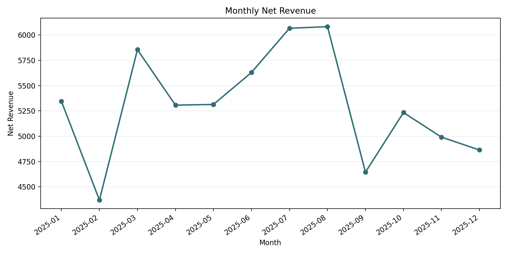
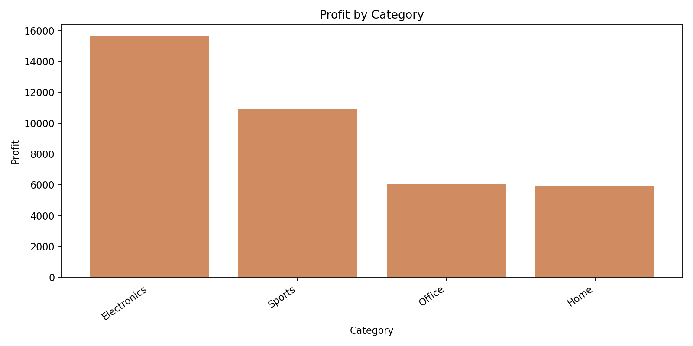
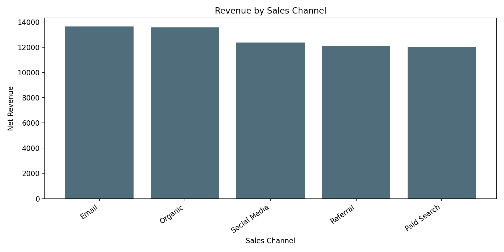
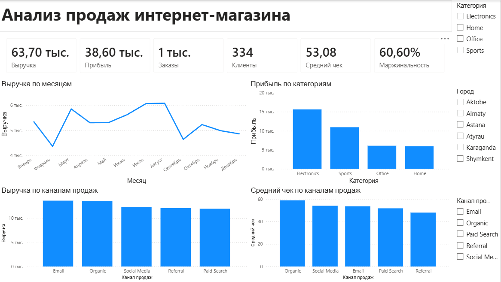

# Анализ продаж интернет-магазина

Портфолио-проект начинающего дата-аналитика: анализ заказов интернет-магазина с помощью Excel, Python, pandas и SQL.

## Краткое описание проекта

В этом проекте анализируются 1 200 заказов интернет-магазина за 2025 год. Цель анализа - понять, сколько магазин заработал, какие категории товаров приносят больше прибыли, какие каналы продаж дают больше выручки и в какие месяцы продажи были сильнее.

Первый анализ был сделан вручную в Excel через сводные таблицы. После этого расчеты были повторены и автоматизированы с помощью Python и pandas. Также в проект добавлены SQL-запросы, чтобы показать, как такие же бизнес-вопросы можно решать через базу данных.

## Основные выводы

- Больше всего прибыли принесли категории **Electronics** и **Sports**.
- Самые сильные каналы по выручке - **Email** и **Organic**.
- Канал **Organic** показал самый высокий средний чек.
- Самый сильный месяц по выручке - **август**, затем **июль**.
- Доля повторных клиентов составила **88,92%**.

## Использованные навыки

- Сводные таблицы в Excel
- Расчет KPI
- Анализ выручки и прибыли
- Расчет среднего чека
- Анализ категорий товаров и каналов продаж
- Анализ данных с помощью Python и pandas
- SQL-запросы для бизнес-анализа
- Оформление проекта на GitHub

## Цель проекта

Ответить на базовые бизнес-вопросы:

- Сколько заказов, клиентов, выручки и прибыли получил магазин?
- Какие категории товаров приносят больше всего прибыли?
- Какие каналы продаж приносят больше всего выручки?
- Какой канал имеет самый высокий средний чек?
- В какие месяцы продажи были сильнее?
- Какие рекомендации можно дать бизнесу?

## Инструменты

- Excel
- Python
- pandas
- SQL
- CSV
- Git / GitHub

## Структура проекта

```text
data/
  orders.csv              Исходный датасет с заказами
  orders_excel_ru.csv     Версия CSV, удобная для русской версии Excel
  data_dictionary.md      Описание колонок датасета
excel/
  sales_analysis_practice.xlsx
                          Ручной анализ в Excel через сводные таблицы
reports/
  *.csv                   Итоговые таблицы анализа
  *.png                   Графики для презентации проекта
powerbi/
  ecommerce_sales_dashboard.pbix
                          Готовый Power BI dashboard
  dashboard_screenshot.png
                          Скриншот dashboard для просмотра на GitHub
scripts/
  generate_data.py        Создание учебного датасета
  create_excel_friendly_csv.py
                          Создание Excel-friendly CSV
  analyze_sales.py        Автоматический анализ данных
sql/
  portfolio_queries.sql   SQL-запросы по бизнес-вопросам
```

## Как запустить проект

```bash
python scripts/generate_data.py
python scripts/analyze_sales.py
```

## Ключевые метрики

Основные KPI сохранены в файле `reports/kpi_summary.csv`.

| Метрика | Значение |
| --- | ---: |
| Количество заказов | 1 200 |
| Количество клиентов | 334 |
| Общая выручка | 63 698,22 |
| Общая прибыль | 38 598,61 |
| Средний чек | 53,08 |
| Доля повторных клиентов | 88,92% |

## Визуализации







## Power BI Dashboard

Для проекта собран интерактивный dashboard в Power BI Desktop.

Файл dashboard:

```text
powerbi/ecommerce_sales_dashboard.pbix
```

Скриншот dashboard:



Dashboard включает:

- KPI-карточки: выручка, прибыль, заказы, клиенты, средний чек
- маржинальность
- динамику выручки по месяцам
- прибыль по категориям
- выручку по каналам продаж
- средний чек по каналам
- фильтры по категории, городу и каналу продаж

## Бизнес-вопросы и результаты

### 1. Динамика выручки по месяцам

Файл `reports/monthly_sales.csv` показывает количество заказов, клиентов, выручку, прибыль и маржинальность по месяцам.

Самая высокая выручка была в августе, на втором месте - июль. Февраль был самым слабым месяцем, поэтому бизнесу стоит отдельно проверить сезонность, спрос и маркетинговую активность в этот период.

### 2. Прибыль по категориям

Файл `reports/category_performance.csv` показывает результат по категориям товаров.

Категория **Electronics** принесла наибольшую прибыль - **15 620,09**. На втором месте **Sports** с прибылью **10 942,98**. Эти две категории являются основными драйверами прибыли.

### 3. Эффективность каналов продаж

Файл `reports/channel_performance.csv` сравнивает каналы Organic, Paid Search, Social Media, Email и Referral.

Каналы **Email** и **Organic** принесли больше всего выручки. При этом **Organic** показал самый высокий средний чек, поэтому этот канал выглядит особенно перспективным для дальнейшего развития.

### 4. Лучшие клиенты

Файл `reports/top_customers.csv` показывает клиентов с наибольшей суммарной выручкой.

Большинство клиентов сделали больше одного заказа. Это значит, что повторные покупки играют важную роль, а в будущем можно сделать более глубокий анализ клиентов, например RFM-сегментацию.

## Рекомендации бизнесу

- Уделять больше внимания категории Electronics, так как она приносит больше всего прибыли.
- Развивать категорию Sports, потому что она является второй по прибыли.
- Усилить Organic-канал: SEO, карточки товаров, описания и контент.
- Продолжать работать с Email-каналом, так как он входит в топ по выручке.
- Изучить, почему июль и август показали лучшие результаты, и попробовать повторить успешные действия.
- Добавить сегментацию клиентов, чтобы лучше понимать повторные покупки и ценных клиентов.

## Что я отработал в проекте

- Создание структуры аналитического проекта
- Работа с CSV-данными
- Первичный анализ в Excel
- Построение сводных таблиц
- Расчет выручки, прибыли, среднего чека и доли повторных клиентов
- Группировка данных по месяцам, категориям и каналам продаж
- Автоматизация анализа с помощью Python
- Написание SQL-запросов
- Оформление проекта для GitHub-портфолио

## Что можно улучшить дальше

- Сделать RFM-анализ клиентов
- Добавить анализ рекламных затрат и ROI каналов
- Сравнить категории по маржинальности и среднему чеку
- Добавить прогноз продаж по месяцам
- Подготовить отдельную версию dashboard для Power BI Service
